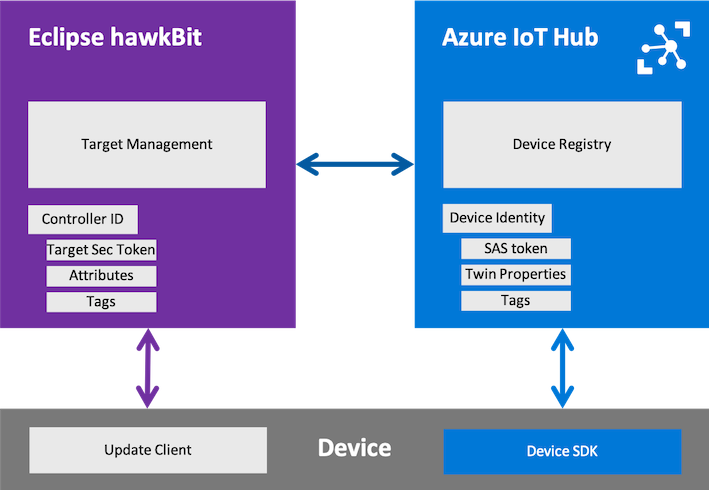
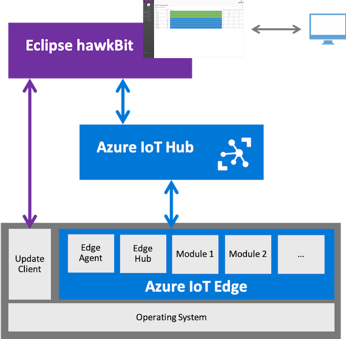

# Eclipse hawkBit with Azure IoT

## Introduction

Eclipse hawkBit and Azure IoT Hub deliver a strong feature set for IoT solution developers and device fleet operators. In many IoT scenarios they can be used together, e.g. hawkBit to manage the gateway software stack and IoT Hub for device connectivity.

However, an integrated package of Hub and hawkBit could offer even more value by means of:

- **Combined device management**, e.g. gateway OS/platform updates by hawkBit Direct Device Integration (DDI) API with its client ecosystem (e.g. [SWupdate](https://github.com/sbabic/swupdate) or [rauc-hawkbit](https://github.com/rauc/rauc-hawkbit)) combined with Azure IoT Hub management of [Azure IoT Edge](https://docs.microsoft.com/en-us/azure/iot-edge/) modules.
- **Improved user experience** by leveraging hawkBit's [graphical user interface](https://www.eclipse.org/hawkbit/ui/) for update and campaign management on top of Azure IoT Hub's highly scalable device management capabilities.
- **Reduced operations overhead** with automatic data synchronization (e.g. device identity registry information).
- **Multi device management orchestration** for campaign management on top of multiple IoT Hubs or hybrid scenarios with custom or 3rd party device managements in the IoT solutions landscape.

This is value add for commercial offerings on top of hawkBit (e.g. [Bosch IoT Rollouts](https://www.bosch-iot-suite.com/rollouts) or [Kynetics Update Factory](https://www.kynetics.com/iot-platform-update-factory)) as well as to IoT Hub connected application owners that embed hawkBit into their landscape.

### Whats is Eclipse hawkBit

[Eclipse hawkBit™](https://www.eclipse.org/hawkbit/) is a domain independent back-end framework for rolling out software updates to constrained edge devices as well as more powerful controllers and gateways connected to IP based networking infrastructure. As such is is highly focused on device management and in that specialized on software update.

This focus allows hawkBit to deliver unique features for the software update use-case as well deliver device facing APIs that are easy to implement, maintain and kept stable due to their reduced feature set.

### What is Azure IoT Hub

[Azure IoT Hub](https://docs.microsoft.com/en-us/azure/iot-hub/) acts as a central message hub for bi-directional communication between IoT applications and the devices it manages. IoT Hub supports communications both from the device to the cloud and from the cloud to the device. IoT Hub supports multiple messaging patterns such as device-to-cloud telemetry, file upload from devices, and request-reply methods to control your devices from the cloud. IoT Hub monitoring helps to maintain the health of the IoT solution by tracking events such as device creation, device failures, and device connections.

## Integration scenarios

### _hawkBit next to Azure IoT Hub_ - Device Registry synchronization

The most simple use case offers the sync of device registry metadata:

- Sync of [device identity](https://docs.microsoft.com/en-us/azure/iot-hub/iot-hub-devguide-identity-registry), i.e. create and delete devices.
- Sync of device authentication keys.
- Sync of IoT Hub [device twin](https://docs.microsoft.com/en-us/azure/iot-hub/iot-hub-devguide-device-twins) properties into hawkBit target attributes.
- Sync of tags.

Benefit is a reduced maintenance effort for users.

### _hawkBit on top of IoT Hub_ - Scalability with a rich user experience

IoT Hub offers a wide range of [device management](https://docs.microsoft.com/en-us/azure/iot-hub/iot-hub-device-management-overview) and bi-directional communication capabilities. However, these capabilities are primarily offered to services/solutions by API in addition to a basic graphical user interface by Azure Portal. [hawkBit's Management UI](https://www.eclipse.org/hawkbit/ui/) offers in addition planning capabilities for rollout/campaign management as well as device software repository management.

A combined solutions offers:

- Highly scalable device with cloud communication as well as action execution by IoT Hub.
- hawkBit software artifact management including rich user interface.
- hawkBit software update campaign planning and execution including rich user interface.
- hawkBit software update history persistence.

### _hawkBit combined with IoT Hub_ - Orchestrated end-to-end software update

Not every Iot device can be updated in the same way and more complex devices like gateway may even need multiple mechanisms for different software layers on it.

IoT Hub is best in class for several software update scenarios, hawkBit for others. However, a lot of additional value can be generated by leveraging the capabilities of the first two integrations scenarios and in addition leverage hawkBit as orchestrator for the overall campaign management of the device fleet.

Orchestration includes:

- Hybrid update strategy for gateways, i.e. hawkBit DDI for OS and Azure IoT Edge and IoT Hub for IoT Edge Modules.
- hawkBit as orchestrator on top of multiple device managements, e.g. multiple IoT Hubs and/or 3rd party device managements.

## Implementation

IoT Hub's [service SDK](https://github.com/Azure/azure-iot-sdk-java) offers all capabilities necessary to integrate while hawkBit with its module structure allows a simple extension point. As result the proposal is to create a hawkBit extension that provides (potential hawkBit core contributions to improve integration are listed as well):

- Multi hub connection to hawkBit instance
  - To be decided IoT Hub per hawkBit tenant or multi hub per tenant.
- Device Registry synchronization:
  - Device identity and key
    - Both directions, configurable which one is master.
  - IoT Hub Device Twin _Reported properties_ to hawkBit _Target attributes_
  - Tags synchronization
  - _hawkBit Core addition: support for secondary target security token._
  - _hawkBit Core addition: target metadata to support IoT hub tag complexity._
- hawkBit Deployment/Rollout management
  - hawkBit _Software module_ representation for _IoT Edge modules_.
  - hawkBit _Deployment management_ to _IoT Hub desired/reported properties_.
  - Hybrid deployment support (i.e. DDI/DMF for OS and Edge for modules).
  - hawkBit _Rollout management_ to IoT Hub _Automatic device management_.
